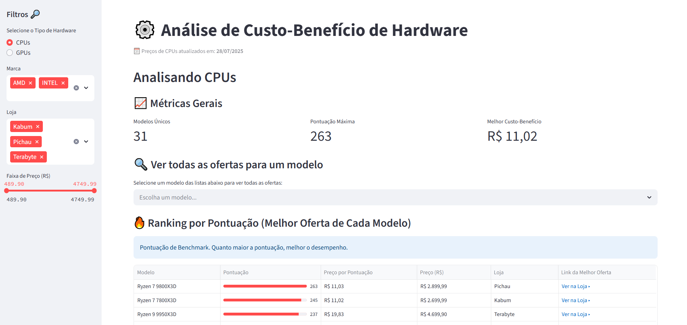
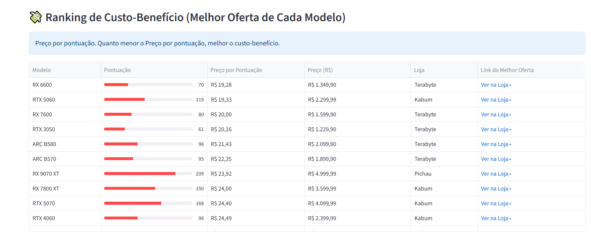
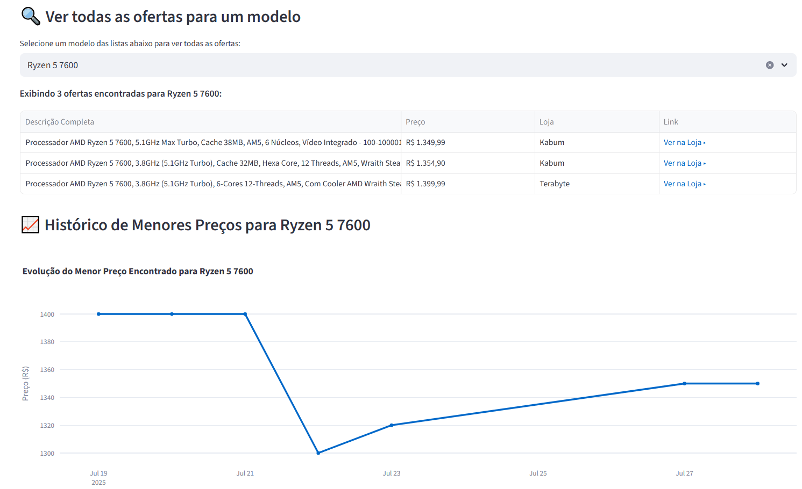

# 🖥️ Análise Custo-Benefício de Hardware Brasileiro

> Sistema de análise de custo-benefício para CPUs e GPUs no mercado brasileiro

[](https://python.org)
[](https://streamlit.io)
[](https://postgresql.org)

## 🎯 Sobre

Este é um projeto de aprendizado voltado para Ciência de Dados, englobando todas as etapas de um pipeline completo de **ETL** — desde a coleta automatizada de dados (scraping), passando pelo tratamento e armazenamento, até a análise e visualização interativa dos resultados.

O sistema realiza a extração de dados de processadores (CPUs) e placas de vídeo (GPUs) das principais lojas brasileiras de hardware. Após o processamento, os dados são organizados e analisados com foco em **custo-benefício**, permitindo comparar componentes com base em benchmarks e preços atualizados.

O resultado final é apresentado em um dashboard interativo, facilitando a tomada de decisão para quem deseja montar ou atualizar seu setup com o melhor retorno por real investido.

## 🚀 Funcionalidades

- 🔍 **Web Scraping** automático com paginação
- 📊 **Pipeline ETL** completo (Extract, Transform, Load)
- 🏆 **Dashboard** com ranking de custo-benefício
- 📈 **Análise histórica** de preços
- 🎯 **Integração** com dados de benchmarks

## 🛠️ Tecnologias

- **Python 3.13+** - Linguagem principal (desenvolvido e testado com esta versão)
- **Playwright** - Automação web
- **Pandas** - Manipulação de dados
- **PostgreSQL** - Banco de dados
- **Streamlit** - Dashboard
- **SQLAlchemy** - ORM

## 📁 Estrutura

```
hardware-analysis/
├── src/
│   ├── extraction/    # Scrapers (Kabum, Pichau, Terabyte)
│   ├── transform/     # Limpeza/normalização de dados
│   ├── load/          # Carregamento (CSV + PostgreSQL)
│   └── dashboard/     # App Streamlit
├── data/              # Dados brutos/processados
├── benchmarks/        # Dados de performance
│   ├── results        # Dados dos benchmarks
│   └── scrapers       # Scrapers do benchmark
├── .env               # Configurações
└── main.py            # Arquivo principal
```

## ⚡ Instalação Rápida

```bash
# 1. Clone o repositório
git clone https://github.com/seu-usuario/scraping_hardware_custo_beneficio.git
cd scraping_hardware_custo_beneficio

# 2. Configure o ambiente
python -m venv .venv
.venv\Scripts\activate  # Windows
# source .venv/bin/activate  # Linux/Mac

# 3. Instale as dependências
pip install -r requirements.txt

# 4. Instale os navegadores necessários
playwright install  # ou: (playwright install chromium) para instalar um específico 

# 5. Edite o arquivo .env com suas credenciais PostgreSQL
```

## 🚀 Como Usar

### **Executar Pipeline Completo**
```bash
python main.py
```

### **Executar Dashboard**
```bash
streamlit run src/dashboard/app.py
```

### **Executar Scraping Específico**
```bash
python src/extraction/seu-scraper-aqui_scraper.py
```

## 📊 Dashboard

O dashboard oferece:
- 🏆 **Ranking** de custo-benefício
- 📊 **Comparação** entre lojas
- 📈 **Análise** histórica de preços
- 🔍 **Filtros** avançados






## 🔧 Configuração

### **PostgreSQL**
```sql
CREATE DATABASE hardware_scraping;
CREATE USER seu_usuario WITH PASSWORD 'sua_senha';
GRANT ALL PRIVILEGES ON DATABASE hardware_scraping TO seu_usuario;
```

### **Variáveis de Ambiente (.env)**
```env
POSTGRESQL_USER=seu_usuario
POSTGRESQL_PASSWORD=sua_senha
POSTGRESQL_HOST=localhost
POSTGRESQL_PORT=5432
DB_NAME=hardware_scraping
```


## ⚠️ Aviso Legal

Este projeto é **apenas para fins educacionais**. Respeite os termos de uso dos sites e não sobrecarregue os servidores.
